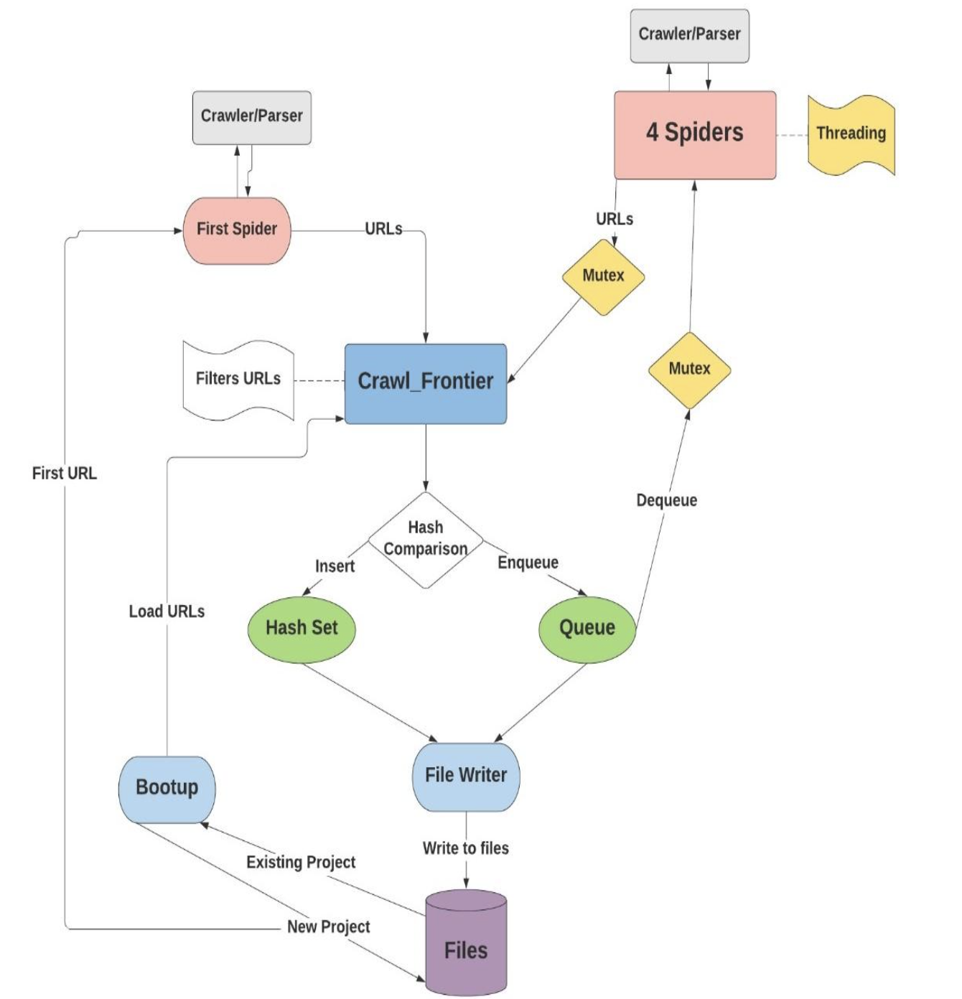

# Crawling Spider


**Crawling Spider** is a lightweight and efficient web crawling bot written in **C**. It recursively scans web pages, extracts valid URLs from a given domain, and allows you to pause, resume, and continue incomplete sessions with saved progress.

---

## 🚀 About the Project

Crawling Spider is a command-line tool built for recursively crawling websites and extracting internal URLs. It respects domain boundaries, supports resume functionality for interrupted crawls, and stores output to local files.

Ideal for learning about low-level web crawlers or extending into more advanced scraping tools.

---

## 🛠 Built With

- **C Language**
- **libcurl** – HTTP requests
- **libtidy** – HTML parsing
- **GCC** – Compilation

---

## ✨ Features

- ✅ CLI-based interface
- ✅ Crawl and extract all internal URLs from a website
- ✅ Filters out external URLs (keeps only same-domain)
- ✅ Pause/Resume functionality via keyboard shortcuts
- ✅ Saves crawl progress to local files
- ✅ Resume from an unfinished crawl session

---

## 🧭 Architecture Diagram



---

## 🧩 Requirements

Make sure your system has:

- Linux OS
- GCC compiler
- `libcurl` and `libtidy` installed

---

## 🔧 Installation

### Option 1: Installation with Docker (Recommended)

The easiest way to run the web crawler is using Docker. This ensures all dependencies are properly installed and the environment is consistent.

#### Prerequisites
- Docker installed on your system ([Install Docker](https://docs.docker.com/get-docker/))
- Docker Compose (optional, for advanced usage)

#### Quick Start with Docker

1. Clone the repository:
```bash
git clone https://github.com/mbilvl/web-crawler-c.git
cd web-crawler-c
```

2. Build and run using Docker:
```bash
# Build the Docker image
docker build -t web-crawler-c .

# Run the crawler
docker run -it web-crawler-c
```

3. To persist crawled data, mount a volume:
```bash
docker run -it -v $(pwd)/output:/app/output web-crawler-c
```

#### Using Docker Compose

For more advanced usage with resource limits and easier management:

```bash
# Start the crawler
docker-compose up

# Run in background
docker-compose up -d

# Stop the crawler
docker-compose down
```

### Option 2: Manual Installation

Install dependencies:

```bash
sudo apt-get install libcurl4-openssl-dev
sudo apt-get install libtidy-dev
```

Clone or download the project, then navigate to its directory and compile:

```bash
make
```

> This will generate `.o` files and an executable named `crawler` in the same directory.

---

## 📦 Usage

Run the executable:

```bash
./crawler
```

Follow the prompts in the terminal to begin crawling your target website.

### Keyboard Controls

- ⏸️ **Pause:** `Ctrl + F`
- ▶️ **Resume:** `Ctrl + Q`
- ❌ **Terminate:** `Ctrl + C`
  > Your progress will be saved automatically in the project folder.

---

## 👤 Contributors

- **Muhammad Bilal**  
  [@bilvl](https://github.com/mbilvl)

---

## 📄 License

This project is licensed under the **MIT License**.

```
MIT License

Copyright (c) 2025 Muhammad Bilal

Permission is hereby granted, free of charge, to any person obtaining a copy
of this software and associated documentation files (the “Software”), to deal
in the Software without restriction, including without limitation the rights
to use, copy, modify, merge, publish, distribute, sublicense, and/or sell
copies of the Software, and to permit persons to whom the Software is
furnished to do so, subject to the following conditions:

The above copyright notice and this permission notice shall be included in
all copies or substantial portions of the Software.

THE SOFTWARE IS PROVIDED “AS IS”, WITHOUT WARRANTY OF ANY KIND, EXPRESS OR
IMPLIED, INCLUDING BUT NOT LIMITED TO THE WARRANTIES OF MERCHANTABILITY,
FITNESS FOR A PARTICULAR PURPOSE AND NONINFRINGEMENT. IN NO EVENT SHALL THE
AUTHORS OR COPYRIGHT HOLDERS BE LIABLE FOR ANY CLAIM, DAMAGES OR OTHER
LIABILITY, WHETHER IN AN ACTION OF CONTRACT, TORT OR OTHERWISE, ARISING FROM,
OUT OF OR IN CONNECTION WITH THE SOFTWARE OR THE USE OR OTHER DEALINGS IN
THE SOFTWARE.
```
